# Data Flow Diagram

## Overview

This diagram illustrates how data flows through the system with emphasis on **tenant isolation** and **authentication paths**.

## Tenant Isolation & Auth Flow

```mermaid
sequenceDiagram
    autonumber
    participant U as 👤 User
    participant C as 📱 Client App
    participant IdP as 🔐 Identity Provider
    participant GW as 🚪 API Gateway
    participant App as ⚙️ Application
    participant DB as 🗄️ PostgreSQL

    Note over U,DB: === AUTHENTICATION FLOW ===
    
    U->>C: Enter credentials
    C->>IdP: POST /oauth/token
    
    Note over IdP: Validate credentials<br/>Load user's tenant_id<br/>Build JWT claims
    
    IdP-->>C: JWT (access_token + refresh_token)
    
    Note over C: JWT Contains:<br/>• sub: user_id<br/>• tid: tenant_id<br/>• roles: [member]<br/>• exp: +15min

    Note over U,DB: === AUTHORIZED REQUEST FLOW ===

    U->>C: Request: "Show my projects"
    C->>GW: GET /api/projects<br/>Authorization: Bearer {JWT}
    
    rect rgb(255, 243, 224)
        Note over GW: GATEWAY VALIDATION
        GW->>GW: 1. Verify JWT signature (RS256)
        GW->>GW: 2. Check token not expired
        GW->>GW: 3. Validate issuer & audience
        GW->>GW: 4. Check rate limits
    end
    
    GW->>App: Forward request + validated claims
    
    rect rgb(232, 245, 233)
        Note over App: APPLICATION LAYER
        App->>App: 5. Extract tenant_id from claims
        App->>App: 6. Extract user_id, roles
        App->>App: 7. Authorize: can user list projects?
    end
    
    App->>DB: SET app.tenant_id = 'uuid-tenant-a'<br/>SET app.user_id = 'uuid-user-1'
    App->>DB: SELECT * FROM projects
    
    rect rgb(243, 229, 245)
        Note over DB: DATABASE LAYER (RLS)
        DB->>DB: 8. RLS policy auto-applies:<br/>WHERE tenant_id = current_setting('app.tenant_id')
        DB->>DB: 9. Returns ONLY Tenant A's projects
    end
    
    DB-->>App: [Project 1, Project 2] (Tenant A only)
    App-->>GW: 200 OK + JSON response
    GW-->>C: Response
    C-->>U: Display projects

    Note over U,DB: === CROSS-TENANT ATTACK BLOCKED ===
    
    U->>C: Malicious: GET /api/projects/tenant-b-project-id
    C->>GW: GET /api/projects/{tenant-b-id}<br/>Authorization: Bearer {JWT for Tenant A}
    GW->>App: Forward (still has Tenant A claims)
    App->>DB: SET app.tenant_id = 'uuid-tenant-a'
    App->>DB: SELECT * FROM projects WHERE id = 'tenant-b-id'
    
    rect rgb(255, 235, 238)
        Note over DB: RLS ENFORCEMENT
        DB->>DB: Query becomes:<br/>SELECT * FROM projects<br/>WHERE id = 'tenant-b-id'<br/>AND tenant_id = 'uuid-tenant-a'
        DB->>DB: ❌ No rows match (Tenant B's data hidden)
    end
    
    DB-->>App: [] (empty result)
    App-->>GW: 404 Not Found
    GW-->>C: Resource not found
```



## Multi-Tenant Data Isolation Model

```mermaid
flowchart TB
    subgraph Requests["Incoming Requests"]
        ReqA["Request from<br/>Tenant A User"]
        ReqB["Request from<br/>Tenant B User"]
        ReqC["Request from<br/>Tenant C User"]
    end

    subgraph JWT["JWT Claims Extraction"]
        ClaimsA["tenant_id: A<br/>user_id: u1<br/>roles: [admin]"]
        ClaimsB["tenant_id: B<br/>user_id: u2<br/>roles: [member]"]
        ClaimsC["tenant_id: C<br/>user_id: u3<br/>roles: [viewer]"]
    end

    subgraph Context["Database Context Setting"]
        CtxA["SET app.tenant_id = 'A'"]
        CtxB["SET app.tenant_id = 'B'"]
        CtxC["SET app.tenant_id = 'C'"]
    end

    subgraph Database["PostgreSQL with RLS"]
        subgraph AllData["projects Table (Physical)"]
            DataA["🔵 Tenant A Data<br/>Projects 1, 2, 3"]
            DataB["🟢 Tenant B Data<br/>Projects 4, 5"]
            DataC["🟣 Tenant C Data<br/>Projects 6, 7, 8, 9"]
        end
        
        RLS["RLS Policy:<br/>tenant_id = current_setting('app.tenant_id')"]
    end

    subgraph Results["Query Results"]
        ResultA["🔵 Returns: Projects 1, 2, 3"]
        ResultB["🟢 Returns: Projects 4, 5"]
        ResultC["🟣 Returns: Projects 6, 7, 8, 9"]
    end

    ReqA --> ClaimsA --> CtxA
    ReqB --> ClaimsB --> CtxB
    ReqC --> ClaimsC --> CtxC

    CtxA --> RLS
    CtxB --> RLS
    CtxC --> RLS

    RLS --> DataA --> ResultA
    RLS --> DataB --> ResultB
    RLS --> DataC --> ResultC

    style DataA fill:#e3f2fd,stroke:#1565c0
    style DataB fill:#e8f5e9,stroke:#2e7d32
    style DataC fill:#f3e5f5,stroke:#7b1fa2
    style ResultA fill:#e3f2fd,stroke:#1565c0
    style ResultB fill:#e8f5e9,stroke:#2e7d32
    style ResultC fill:#f3e5f5,stroke:#7b1fa2
```



## Token Refresh Flow


## Write Operation Flow

```mermaid
sequenceDiagram
    participant C as 📱 Client
    participant App as ⚙️ Application
    participant DB as 🗄️ PostgreSQL
    participant Audit as 📋 Audit Log

    C->>App: POST /api/projects<br/>{name: "New Project"}

    App->>App: 1. Validate input
    App->>App: 2. Extract tenant_id from JWT
    App->>App: 3. Check permission: can_create_project?

    App->>DB: BEGIN TRANSACTION
    App->>DB: SET app.tenant_id = 'uuid'<br/>SET app.user_id = 'uuid'
    
    Note over DB: RLS INSERT policy checks:<br/>tenant_id in NEW row = app.tenant_id

    App->>DB: INSERT INTO projects<br/>(id, tenant_id, name, created_by)<br/>VALUES (gen_uuid(), app.tenant_id, 'New Project', app.user_id)
    
    DB-->>App: INSERT successful

    App->>Audit: Log: {action: 'create', resource: 'project',<br/>resource_id: 'xxx', tenant_id: 'xxx',<br/>user_id: 'xxx', timestamp: now()}

    App->>DB: COMMIT

    App-->>C: 201 Created<br/>{id: 'new-project-id'}
```



## Key Security Properties

### Data Never Crosses Tenant Boundaries

| Layer | Enforcement Mechanism |
|-------|----------------------|
| API Gateway | JWT validation ensures authentic tenant claim |
| Application | tenant_id extracted from JWT, never from request body |
| Database | RLS policies filter every query by tenant_id |
| Logs | tenant_id included in all audit records |

### Defense in Depth

```
Layer 1: Gateway    → Rejects invalid/expired tokens
Layer 2: App        → Rejects unauthorized operations  
Layer 3: Database   → Filters data even if app has bugs
Layer 4: Audit      → Detects anomalies after the fact
```

### What Cannot Happen

With this architecture properly implemented:

1. ❌ User cannot see another tenant's data (RLS enforces isolation)
2. ❌ User cannot modify another tenant's data (RLS blocks writes)
3. ❌ User cannot guess resource IDs to access them (UUID + RLS)
4. ❌ Attacker cannot forge tenant claims (JWT signature verification)
5. ❌ Expired tokens cannot be used (expiry validation)
6. ❌ App bugs cannot bypass isolation (database-level enforcement)

