# System Architecture Diagram

## Overview

This diagram shows the high-level system components and trust boundaries for a multi-tenant B2B SaaS.

## Component & Trust Boundary Diagram

```mermaid
flowchart TB
    subgraph Internet["🌐 INTERNET (Untrusted)"]
        User["👤 User Browser/Client"]
        Attacker["🔴 Potential Attacker"]
    end

    subgraph Edge["🛡️ EDGE LAYER (Trust: Low)"]
        CDN["CloudFront/Cloudflare<br/>CDN + WAF"]
        DDoS["DDoS Protection"]
    end

    subgraph Gateway["🚪 API GATEWAY (Trust: Medium)"]
        APIGW["API Gateway<br/>• JWT Validation<br/>• Rate Limiting<br/>• Request Routing"]
        
        subgraph AuthFlow["Authentication"]
            IdP["Identity Provider<br/>(Auth0/Cognito)"]
        end
    end

    subgraph App["⚙️ APPLICATION LAYER (Trust: High)"]
        API["API Service<br/>• Business Logic<br/>• Authorization<br/>• Tenant Context"]
        
        subgraph Security["Security Middleware"]
            TenantCtx["Tenant Context<br/>Extractor"]
            AuthZ["Authorization<br/>Engine"]
            Sanitizer["Input<br/>Sanitizer"]
        end
        
        Workers["Background Workers<br/>• Async Jobs<br/>• Notifications"]
    end

    subgraph Data["🗄️ DATA LAYER (Trust: Highest)"]
        subgraph DB["PostgreSQL Cluster"]
            Primary["Primary DB<br/>• RLS Enabled<br/>• Encrypted"]
            Replica["Read Replica"]
        end
        
        Cache["Redis Cache<br/>• Session Data<br/>• Rate Limit Counters"]
        
        ObjectStore["S3/GCS<br/>• Tenant-Prefixed<br/>• Encrypted"]
    end

    subgraph Ops["🔧 OPERATIONS (Trust: Internal)"]
        Logs["Log Aggregator<br/>(CloudWatch/Datadog)"]
        Secrets["Secrets Manager<br/>(AWS SM/Vault)"]
        Monitoring["Monitoring<br/>& Alerting"]
    end

    %% Connections
    User -->|HTTPS| CDN
    Attacker -.->|Blocked| DDoS
    CDN --> APIGW
    DDoS --> CDN
    
    APIGW -->|Validate JWT| IdP
    APIGW -->|Authenticated Request| API
    
    API --> TenantCtx
    TenantCtx --> AuthZ
    AuthZ --> Sanitizer
    Sanitizer --> API
    
    API -->|Set tenant context| Primary
    API --> Cache
    API --> ObjectStore
    Workers --> Primary
    
    Primary --> Replica
    
    API --> Logs
    API -.->|Fetch secrets| Secrets
    Logs --> Monitoring

    %% Trust Boundary Styling
    style Internet fill:#ffebee,stroke:#c62828
    style Edge fill:#fff3e0,stroke:#ef6c00
    style Gateway fill:#e3f2fd,stroke:#1565c0
    style App fill:#e8f5e9,stroke:#2e7d32
    style Data fill:#f3e5f5,stroke:#7b1fa2
    style Ops fill:#fafafa,stroke:#616161
```



## Trust Boundaries Explained

| Boundary | Trust Level | What Crosses It | Security Controls |
|----------|-------------|-----------------|-------------------|
| Internet → Edge | None → Low | All external traffic | TLS, WAF rules, DDoS mitigation |
| Edge → Gateway | Low → Medium | Filtered HTTPS requests | JWT validation, rate limiting |
| Gateway → App | Medium → High | Authenticated requests | Tenant context injection, authorization |
| App → Data | High → Highest | Database queries | RLS policies, connection context |

## Component Responsibilities

### Edge Layer
- **CDN**: Cache static assets, terminate TLS, apply WAF rules
- **DDoS Protection**: Absorb volumetric attacks, block malicious IPs

### API Gateway
- **JWT Validation**: Verify signature, expiry, issuer, audience
- **Rate Limiting**: Per-tenant and per-user request throttling
- **Request Routing**: Direct to appropriate backend service

### Identity Provider
- **Authentication**: Validate credentials, issue tokens
- **MFA**: Enforce second factor for privileged operations
- **Session Management**: Token refresh, revocation

### Application Layer
- **Tenant Context**: Extract tenant_id from JWT, never from request
- **Authorization**: RBAC + ownership checks before data access
- **Business Logic**: Domain operations with security boundaries

### Data Layer
- **PostgreSQL + RLS**: Row-level isolation, deny-by-default policies
- **Redis**: Ephemeral data, tenant-namespaced keys
- **Object Storage**: Tenant-prefixed paths, encrypted at rest

## Data Flow Summary

```
1. User authenticates → IdP issues JWT with tenant_id claim
2. Request with JWT → Gateway validates signature + expiry
3. Gateway passes claims → App extracts tenant context
4. App sets session vars → Database enforces RLS
5. Query executes → Only tenant's data returned
6. Response flows back → Audit logged (no PII)
```

## Security Invariants

These must ALWAYS be true:

1. **Tenant ID Source**: `tenant_id` comes ONLY from validated JWT claims
2. **RLS Active**: Every table with tenant data has RLS enabled and enforced
3. **Default Deny**: Missing context = request denied, not default tenant
4. **Audit Trail**: All mutations logged with tenant + user context
5. **No Secrets in Code**: All credentials from Secrets Manager at runtime

